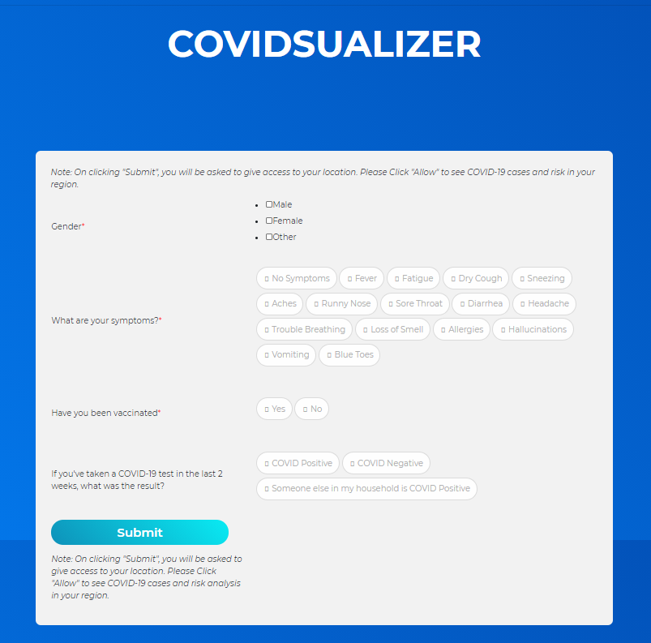
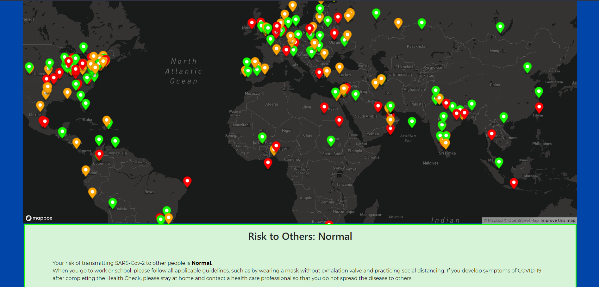

# COVIDSUALISER
#### Video Demo:  https://youtu.be/fEYT0BSyGxc
#### Description: A COVID-19 Health and Risk Tracker. 

COVIDSUALISER is a COVID-19 Health and Risk Tracker. It was created as an effort to visualize how much risk one possesses to spread COVID-19 based on their symptoms and other information. The application uses a Flask server to run and uses a couple of 3rd party APIs for some functionality.

*The application does log your location, so please use it at your own discretion.*
 

The application conducts a small survey regarding your health and internally computes your `riskScore` which is then displayed on a Map, along with the locations of other users who took the survey in the past 14 days, along with their `riskScore` which is correlated with a color code. 
* `red` markers mean **_HIGH_ risk** 
* `orange` markers mean **_ELEVATED_ risk**
* `green` markers mean **_NORMAL_ risk**

Notice that none of the markers mean that you are safe and do not have COVID. You will need to abide by safety measures regardless in order to minimize risk of exposure to others. 
This application **_does not_** say if you have COVID, it just assesses your risk from information provided by you, and shows you the results from others in your surrounding region, and hence you can make an informed decision on the **_HIGH_ risk** areas you may want to avoid visiting for the time being.

### Working and Specifications
*The application is not deployed as a live web application yet.*
* Upon landing on the main `/` page, which renders `form.html`, you will be seeing the HTML form with the survey.
* On completion of the survey and clicking `SUBMIT` your `riskScore` will be calculated from your inputs, as you are redirected to `/maps`.
* `/maps` displays a Map with your location marked and you can view all the other markers on the map. You can also see your `riskScore` mentioned and few words of advice.

#### API Usage
The application uses a couple of APIs for retrieving `lat`,`lng`, and for the `maps`. 
* **WHOISSML API (for `lat` & `lng`)** - I decided to use this because it easily provides all the information I needed, and even though I could've implemented the same code for retrieving the information without API, I was facing a few technical difficulties which made me resort to this for the short term. If needed I could deprecate its use in the long run, and figure out how to run it without the API.
* **Mapbox API (for `maps`)** - The Mapbox API is used to display the maps. I initially set out to use the Google Maps Javascript API, but it was harder to work with and the documentation didn't feel as good, and also the map had a watermark which was annoying. I hence resorted to Mapbox which had a clean and intuitive documentation, and also has different styles for the maps - which I really liked.

#### Database
COVIDSUALISER uses an SQLlite3 database, to log the `lat`, `lng`, `riskScore`, and `datetime`. 
`lat` - latitude of the user
`lng` - longitude of the user
`riskScore` - risk associated with the inputs provided in the form.
`datetime` - date and time at which the user logged the input
`datetime` is used to show only the location of users in the past 14 days. This is based out of the approximated time that scientists have claimed that a person would need to wait to check for any symptoms, so after 14 days, the user's `riskScore` will have obviously changed, hence we need to reflect it.

#### Flask (application.py)
Flask manages most of the backend process. 
It currently has 2 routes. `/` and `/maps`, which has been discussed above.

### Roadmap
* Eventually deprecate the use of WHOISXML API and retrieve `lat` and `lng` directly from backend. 

